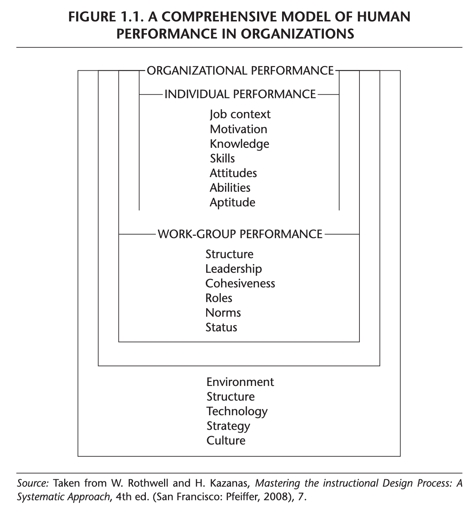
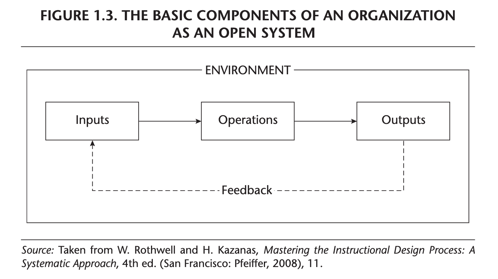
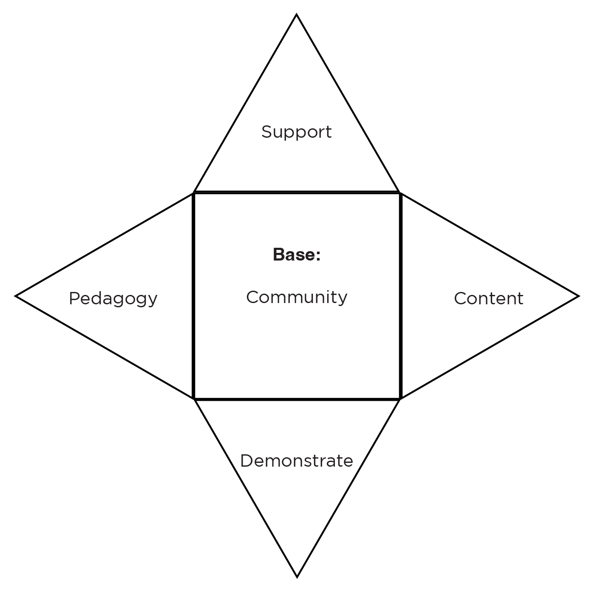

```{r setup, include=FALSE}
usethis::use_git_ignore(c("*.csv", "*.rds"))
options(htmltools.dir.version = FALSE)

library(knitr)
library(tidyverse)
library(xaringan)
library(fontawesome)
```

class: inverse, center, middle

# `r fa("fas fa-images", fill = "#fff")`

**View the slides:** 

[bretsw.com/eme5601-fs23-module2](https://bretsw.com/eme5601-fs23-module2)

---

class: inverse, center, middle

# `r fa("fas fa-door-open", fill = "#fff")` <br><br> Welcome to EME5601!

---

class: inverse, center, middle

# `r fa("fas fa-door-open", fill = "#fff")` <br><br> Introduce yourself <br> (again)

Name

Preferred pronouns

Research goals (significance, answering "So what?")

Favorite piece of writing (a novel, a poem, song lyrics, a movie quote, etc.)

---

class: inverse, center, middle

# `r fa("fas fa-cubes-stacked", fill = "#fff")` <br><br> Module 1 <br> Intro to ISD

---

class: inverse, center, middle

# `r fa("fas fa-cubes-stacked", fill = "#fff")` <br><br> Instructional Systems Design (ISD) = <br><br> analyzing human performance problems systematically

---

# `r fa("fas fa-cubes-stacked", fill = "#fff")` 6 Characteristics of ISD

```{r, out.width = "600px", echo = FALSE, fig.align = "center"}
include_graphics("img/2-ISD-model.png")
```

1. Emerging profession
2. Focused on establishing and maintaining efficient and effective human performance
3. Guided by a model of human performance
4. Carried out systematically
5. Based on Open Systems Theory
6. Oriented to finding and applying the most cost-effective solutions to human performance problems

---

# `r fa("fas fa-cubes-stacked", fill = "#fff")` 6 Characteristics of ISD

```{r, out.width = "600px", echo = FALSE, fig.align = "center"}
include_graphics("img/2-ISD-model.png")
```

1. **Emerging profession**
2. Focused on establishing and maintaining efficient and effective human performance
3. Guided by a model of human performance
4. Carried out systematically
5. Based on Open Systems Theory
6. Oriented to finding and applying the most cost-effective solutions to human performance problems

---

# `r fa("fas fa-cubes-stacked", fill = "#fff")` 6 Characteristics of ISD

```{r, out.width = "600px", echo = FALSE, fig.align = "center"}
include_graphics("img/2-ISD-model.png")
```

1. Emerging profession
2. **Focused on establishing and maintaining efficient and effective human performance**
3. Guided by a model of human performance
4. Carried out systematically
5. Based on Open Systems Theory
6. Oriented to finding and applying the most cost-effective solutions to human performance problems

---

# `r fa("fas fa-cubes-stacked", fill = "#fff")` 6 Characteristics of ISD

```{r, out.width = "280px", echo = FALSE, fig.align = "center"}

```

<div class="caption">
Figure 1.1 from Rothwell et al. (2016, p. 8)
</div>

1. Emerging profession
2. Focused on establishing and maintaining efficient and effective human performance
3. **Guided by a model of human performance**
4. Carried out systematically
5. Based on Open Systems Theory
6. Oriented to finding and applying the most cost-effective solutions to human performance problems

---

# `r fa("fas fa-cubes-stacked", fill = "#fff")` 6 Characteristics of ISD

```{r, out.width = "600px", echo = FALSE, fig.align = "center"}
include_graphics("img/2-ISD-model.png")
```

1. Emerging profession
2. Focused on establishing and maintaining efficient and effective human performance
3. Guided by a model of human performance
4. **Carried out systematically**
5. Based on Open Systems Theory
6. Oriented to finding and applying the most cost-effective solutions to human performance problems

---

# `r fa("fas fa-cubes-stacked", fill = "#fff")` 6 Characteristics of ISD

```{r, out.width = "560px", echo = FALSE, fig.align = "center"}

```

<div class="caption">
Figure 1.3 from Rothwell et al. (2016, p. 12)
</div>

1. Emerging profession
2. Focused on establishing and maintaining efficient and effective human performance
3. Guided by a model of human performance
4. Carried out systematically
5. **Based on Open Systems Theory**
6. Oriented to finding and applying the most cost-effective solutions to human performance problems

---

# `r fa("fas fa-cubes-stacked", fill = "#fff")` 6 Characteristics of ISD

```{r, out.width = "600px", echo = FALSE, fig.align = "center"}
include_graphics("img/2-ISD-model.png")
```

1. Emerging profession
2. Focused on establishing and maintaining efficient and effective human performance
3. Guided by a model of human performance
4. Carried out systematically
5. Based on Open Systems Theory
6. **Oriented to finding and applying the most cost-effective solutions to human performance problems**

---

class: inverse, center, middle

# `r fa("fas fa-cubes-stacked", fill = "#fff")` <br><br> ISD = <br><br> analyzing human performance problems systematically

**What are human performance problems in your field?**

---

class: inverse, center, middle

# `r fa("fas fa-triangle-exclamation", fill = "#fff")` <br><br> Critiques of ISD

---

# `r fa("fas fa-triangle-exclamation", fill = "#fff")` Critiques of ISD

```{r, out.width = "360px", echo = FALSE, fig.align = "center"}

```

--

- Too slow

--

- Too linear

--

- Too out of touch with technology

---

# `r fa("fas fa-share-nodes", fill = "#fff")` Alternatives to ISD

- Successive Approximation Model (SAM): rapid prototyping

--

- Idiosyncratic approaches: survival 

--

- Universal Design for Learning (UDL)

--

- Culturally Sustaining Instructional Design

```{r, out.width = "320px", echo = FALSE, fig.align = "center"}

```

<div class="caption">
Smith & Staudt Willet (2023) in <a href="https://edtechbooks.org/jaid_12_2/a_model_for_culturally_sustaining_instructional_design">Journal of Applied Instructional Design</a>
</div>

---

class: inverse, center, middle

# `r fa("far fa-comments", fill = "#fff")` <br><br> How would you redesign ISD (ID3)?

---

class: inverse, center, middle

# `r fa("fas fa-cubes-stacked", fill = "#fff")` <br><br> Module 2 <br> Systems Analysis

---

class: inverse, center, middle

# `r fa("fas fa-cubes-stacked", fill = "#fff")` <br><br> ISD in an Organization <br> (Ch. 17)

---

# `r fa("fas fa-cubes-stacked", fill = "#fff")` ISD in an Organization

```{r, out.width = "480px", echo = FALSE, fig.align = "center"}

```

--

**How and where does ISD fit in an org?**

--

- *Human Resources* Center of Expertise Model

--

- *Embedded* Model: Within a business unit

--

- ISD *Community of Practice*

---

class: inverse, center, middle

# `r fa("far fa-comments", fill = "#fff")` <br><br> Where should ISD sit in your organization?

---

# `r fa("fas fa-cubes-stacked", fill = "#fff")` ISD in an Organization

```{r, out.width = "480px", echo = FALSE, fig.align = "center"}

```

**How and why does ISD contribute to the org?**

---

# `r fa("fas fa-cubes-stacked", fill = "#fff")` ISD in an Organization

```{r, out.width = "480px", echo = FALSE, fig.align = "center"}

```

**How do you bring ISD into the org?**

--

Recruit, develop, and manage ISD talent:

--

- Plan

--

- Create professional learning opportunities

--

- Chart paths for career progression

---

class: inverse, center, middle

# `r fa("far fa-handshake", fill = "#fff")` <br><br> Partnerships and Collaborations <br> (Ch. 18)

---

# `r fa("far fa-handshake", fill = "#fff")` Rapport

```{r, out.width = "480px", echo = FALSE, fig.align = "center"}

```

--

- Navigating position power

--

- Asking questions

--

- Listening actively: feeling (emotional) components as much as the content (meaning) components

--

<div class="caption">
See Table 18.1 in Rothwell et al. (2016, p.323)
</div>

---

class: inverse, center, middle

# `r fa("far fa-comments", fill = "#fff")` <br><br> What are your keys to building rapport?

---

# `r fa("far fa-handshake", fill = "#fff")` Relational Challenges

```{r, out.width = "480px", echo = FALSE, fig.align = "center"}

```

--

- Conflict

--

- Off-task

--

- Loss of focus

---

class: inverse, center, middle

# `r fa("far fa-comments", fill = "#fff")` <br><br> What challenges have you navigated?

---

class: inverse, center, middle

# `r fa("fas fa-screwdriver-wrench", fill = "#fff")` <br><br> ISD Project Management <br> (Ch. 19)

---

# `r fa("fas fa-screwdriver-wrench", fill = "#fff")` Project Foundations

```{r, out.width = "600px", echo = FALSE, fig.align = "center"}

```

--

- Front end: Establishing scope and goals

--

- Back end: Resources and budgets

---

# `r fa("fas fa-screwdriver-wrench", fill = "#fff")` Project Management Tools

```{r, out.width = "420px", echo = FALSE, fig.align = "center"}

```

--
- Project management software

--

- Collaboration software

--

- Dashboards

--

- Scorecards

--

- Responsibility charting

--

- Video conferencing

---

class: inverse, center, middle

# `r fa("far fa-comments", fill = "#fff")` <br><br> What other tools have you used?


---

class: inverse, center, middle

# `r fa("fas fa-binoculars", fill = "#fff")` <br><br> Looking ahead

---

# `r fa("fas fa-calendar-day", fill = "#fff")` Semester Schedule

--

- **Module 1:** Introduction to Instructional Systems Design

--

- **Module 2:** Systems Analysis

--

- **Module 3:** ISD & HPT

--

- **Module 4:** Needs Assessment

--

- **Module 5:** Work Analysis

--

- **Module 6:** Design & Development

--

- **Module 7:** Evaluation

---

# `r fa("fas fa-list", fill = "#fff")` Module Structure

```{r, out.width = "540px", echo = FALSE, fig.align = "center"}
include_graphics("img/workshop.jpg")
```

--

- `r fa("fas fa-video", fill = "#782F40")` Optional Office Hours: **Mondays 3:30-4:00pm EST**

--

- `r fa("fas fa-book-open", fill = "#782F40")` Read

--

- `r fa("far fa-comments", fill = "#782F40")` Meet: **Wednesdays 3:05-5:40pm EST**

--

- `r fa("fas fa-keyboard", fill = "#782F40")` Create

---

# `r fa("far fa-keyboard", fill = "#fff")` Major Assignments

```{r, out.width = "260px", echo = FALSE, fig.align = "center"}
include_graphics("img/build.jpg")
```

- **Assignments** (70%)

--

  - Module 2 Assignment: Systems Analysis paper (150 points)

--

  - Module 3 Assignment: Annotated Bibliography 1 (50 points)

--

  - Module 4 Assignment: Needs Assessment paper (150 points)

--

  - Module 5 Assignment: Annotated Bibliography 2 (50 points)

--

  - Module 6 Assignment: Work Analysis paper (150 points)

--

  - Module 7 Assignment: ISD Process Model paper (150 points)

---

class: inverse, center, middle

# `r fa("fas fa-question", fill = "#fff")` <br><br> Questions

<hr>

**What questions can I answer for you now?**

**How can I support you this week?**

<hr>

`r fa("fas fa-envelope", fill = "#fff")` [bret.staudtwillet@fsu.edu](mailto:bret.staudtwillet@fsu.edu) | `r fa("fas fa-globe", fill = "#fff")` [bretsw.com](https://bretsw.com) | `r fa("fab fa-github", fill = "#fff")` [GitHub](https://github.com/bretsw/)